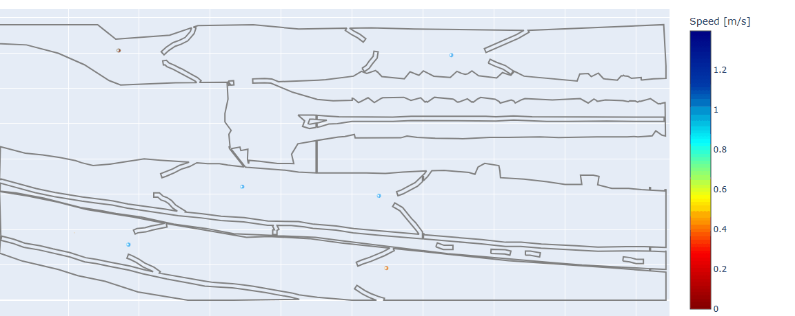
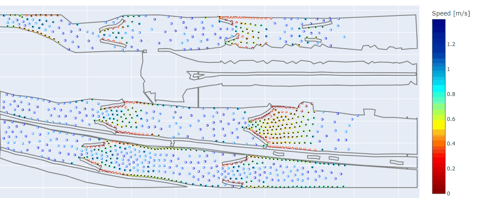
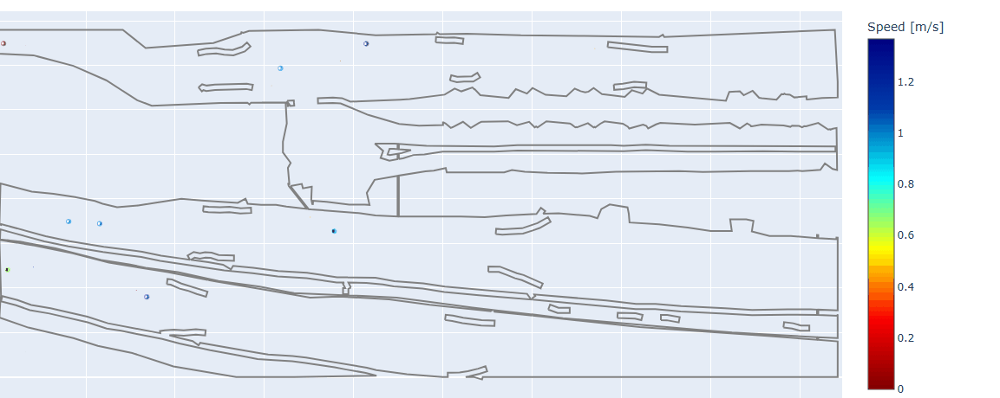
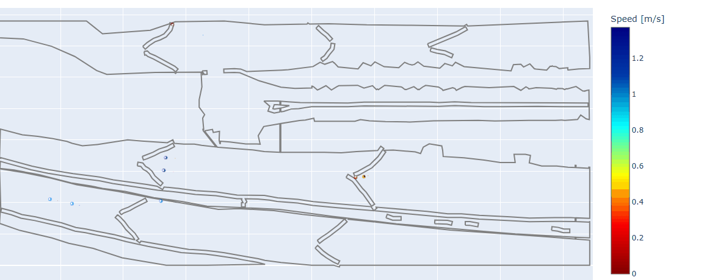
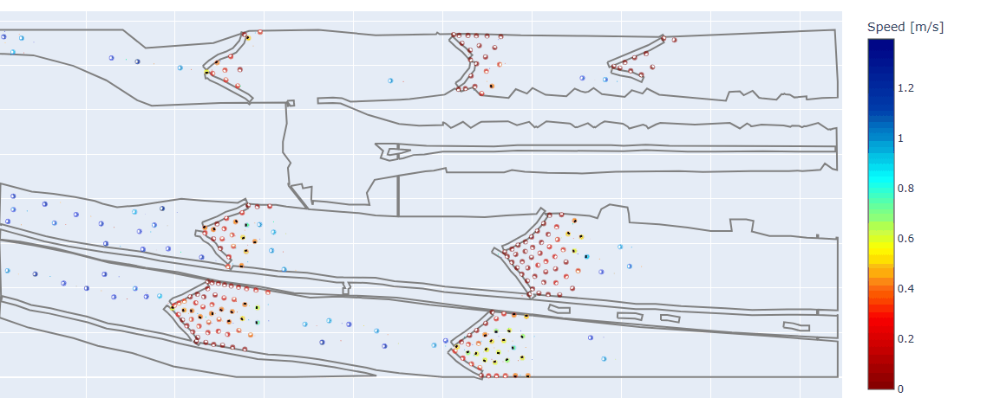
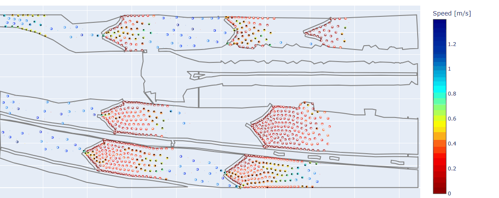

# Reinforcement Learning for Adaptive Crowd Flow Control Using Dynamic Barriers

> Reinforcement learning framework for adaptive pedestrian barrier control in high-density crowd simulations using JuPedSim.

---

## Overview

<div align="center">


**Figure 1.** Overview of the proposed RL-based adaptive barrier control framework.

</div>

---

## Abstract

> *(Add your paper abstract here.)*


### ✨ Key Features

- Continuous reinforcement learning, Soft Actor-Critic (SAC), control of barrier states.
- Adaptive multi-barrier coordination.
- Crowd simulation using JuPedSim.
- Single-GPU and parallel multi-CPU training pipelines.
- Generalization to unseen crowd scenarios.
- Quantitative and qualitative evaluation across varying number of crowd agents.


---

## Installation

Clone the repository

```bash
git clone https://github.com/USERNAME/RLForHajjProject.git
cd RLForHajjProject
```

### Create Conda environment

```bash
conda create -n rl_hajj python=3.11
conda activate rl_hajj
```

Install dependencies

```bash
pip install -r requirements.txt
```

---

## Training

Two training implementations are provided. 
Experimental setup: The proposed model was trained on a Paperspace cloud workstation with NVIDIA RTX A4000 GPUs (16 GB) and 12 CPU cores. Parallel crowd simulations were used during training, and 100 episodes were completed in approximately 4 h 44 min.
### Option 1 — Standard Training

Recommended for a single workstation.

Resources

- 1 CPU
- 1 GPU

```bash
cd runners
python train_RL.py
```

---

### Option 2 — Parallel Training

Designed for multi-core machines.

Resources

- 1 GPU
- N CPU cores

The environment rollouts are executed in parallel while the neural network is updated on a single GPU.

```bash
cd runners
python train_RL_parallel.py
```

---

## Evaluation

Evaluate a trained policy

```bash
cd runners
python evaluate_GT_parallel.py
python evaluate_policy_parallel.py
```

---

## Qualitative Results

The following animations compare different barrier control strategies under various crowd densities.

| Number of Agents |          Ground Truth Configuration          |                   RL Policy Configuration                   |
|:----------------:|:--------------------------------------------:|:-----------------------------------------------------------:|
|        10        |   |                |
|       300        |  |               |
|       1500       | |              |

---

| Number of Agents |              All Open Barrier              |                 All Closed Barrier                  |
|:----------------:|:------------------------------------------:|:--------------------------------------------:|
|        10        |    |    |
|       300        |   |   |
|       1500       |  |  |

---

## Paper

If you use this repository, please cite

```bibtex
Coming soon.
```

The accompanying short paper can be found here:

```
paper/RL_Crowd_Barrier_Control.pdf
```

---

## Contact

**Alhanouf Alolyan**

📧 Email: hano.alolyan@gmail.com

🔗 LinkedIn: https://www.linkedin.com/in/hano-alolyan

🐙 GitHub: https://github.com/HanoCat