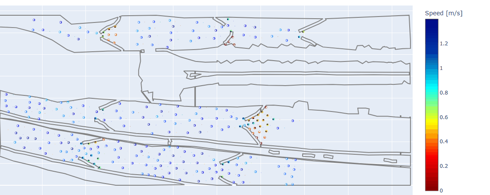
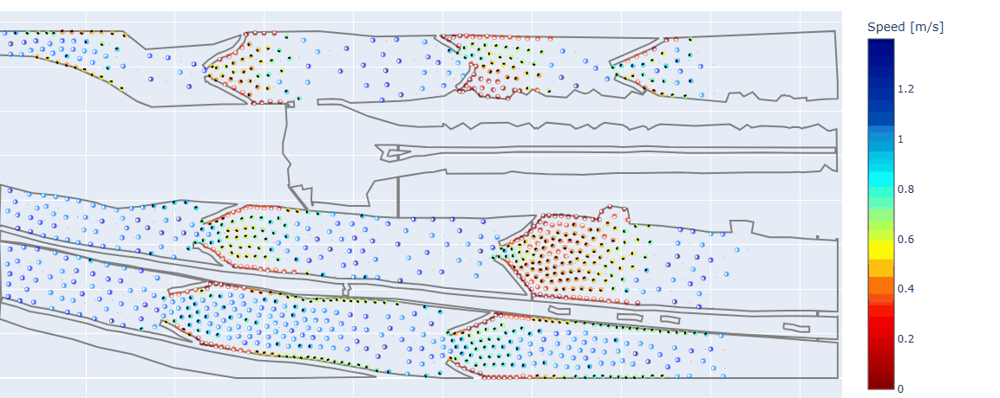
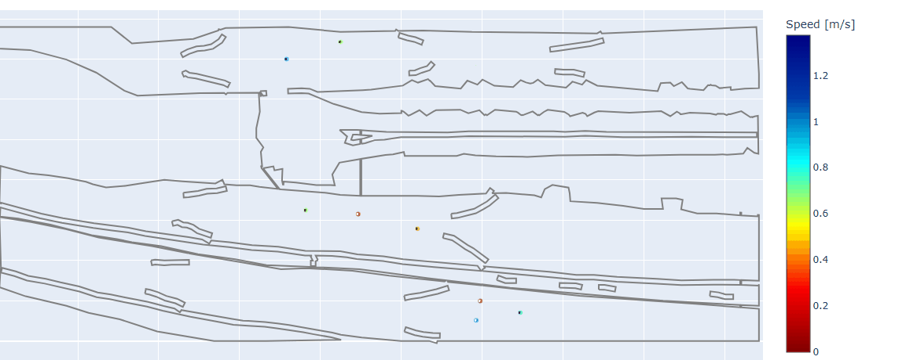
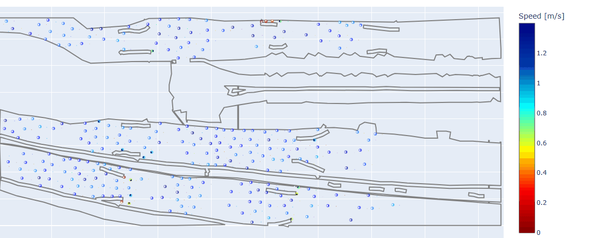
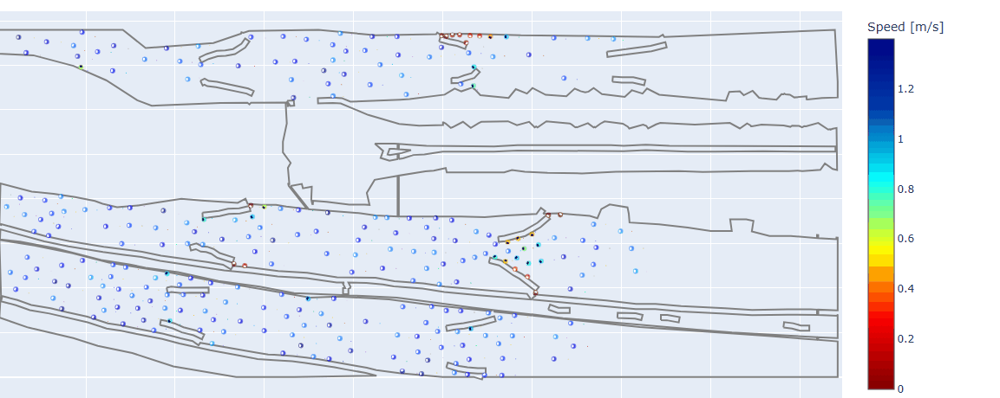
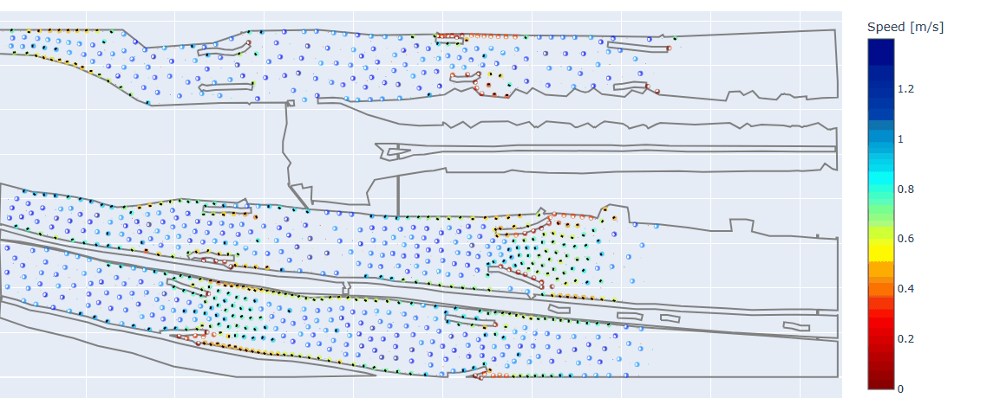

# APBC-RL 

(Adaptive Pedestrian Barrier Control using Reinforcement Learning) is a framework for optimizing pedestrian barrier configurations in JuPedSim crowd simulations.


Repo for the paper: "APBC-RL: Adaptive Pedestrian Barrier Control Framework for Crowd Simulations Based on Reinforcement Learning".


---

## 📝 Overview

Crowd barriers are widely used to regulate pedestrian movement during large public events such as pilgrimages. However, fixed barrier layouts often create unnecessary stopping and local congestion even when they successfully control the overall crowd flow. Finding better barrier configurations is difficult because there is no dataset that provides the best barrier placement for a given crowd scene. We address this challenge by introducing a simulation-driven reinforcement learning framework that learns barrier configurations without requiring labelled training data. Starting from a segmented crowd scene we construct a realistic simulation environment that reproduces the observed pedestrian distribution. This environment is then used to train a Soft Actor-Critic (SAC) agent that continuously adjusts barrier positions to improve pedestrian movement. Unlike supervised approaches the proposed framework allows the agent to explore barrier configurations that have never been observed in real data. We evaluate the learned policy under unseen numbers of pedestrians. The learned policy consistently outperforms the existing manually designed barrier configuration by reducing pedestrian stops while maintaining effective flow regulation. These results demonstrate that combining computer vision crowd simulation and reinforcement learning provides an effective framework for optimizing crowd control infrastructure.

### ✨ Key Features

- **Modular reinforcement learning framework** – easily replace the RL algorithm (e.g., SAC, PPO, TD3, etc.).
- **Flexible crowd simulation** – supports different JuPedSim crowd models (currently CollisionFreeSpeedModelV2).
- **Adaptive multi-barrier control** – continuous optimization of multiple barrier pairs.
- **Scenario exploration** – configure agents, barriers, and simulation settings without changing the source code.
- **Sequential and parallel simulation pipelines** – accelerate RL training by running JuPedSim simulations in parallel across CPU cores while the RL policy trains on the GPU.
- **Built-in evaluation** – quantitative metrics, interactive HTML visualization, and qualitative analysis.
- **Generalization experiments** – evaluate trained policies on unseen crowd scenarios.


<div align="center">


**Figure 1.** Overview of the proposed RL-based adaptive barrier control framework.

</div>

---
## 🔥 Quick Start

### Requirements

- Python 3.11
- Miniforge (recommended)
- JuPedSim 1.4.2
- Torch: 2.7.1
- CUDA: 12.8 (for GPU support)
- 8 GB+ RAM (16 GB+ recommended for RL training)
- **Training modes:**  Sequential (1 CPU + 1 GPU) or Parallel (12 CPU cores + 1 GPU)
- The complete environment pkgs used for development is provided in `environment.yml`.

---

### Installation


```bash
# Clone the repository
git clone https://github.com/HanoCat/RLForHajjProject.git
cd RLForHajjProject

# Option 1: Create a Conda environment and install dependencies
conda create -n rl_hajj python=3.11
conda activate rl_hajj
pip install -r requirements.txt

# OR

# Option 2: Recreate the development environment
conda env create -f environment.yml
conda activate rl_hajj
```

### Download the P2PNet model (Optional)

P2PNet is **optional** and is only required when `p2pnet_load` is enabled in the configuration files.

```bash
# Clone the official P2PNet repository
git clone https://github.com/TencentYoutuResearch/CrowdCounting-P2PNet.git ./CrowdCounting-P2PNet

# Install the P2PNet dependencies
pip install -r ./CrowdCounting-P2PNet/requirements.txt
```

The cloned repository includes the pre-trained model at:

> `./CrowdCounting-P2PNet/weights/SHTechA.pth`

---
## 🎮 Run a Scenario

Before training an RL policy, you can explore the crowd simulation environment by running a scenario. This allows you to experiment with different barrier configurations, agent initialization methods, and simulation parameters, and observe their effects through the generated metrics and interactive HTML visualization.

Run the default scenario:

```bash
python main.py
```

or equivalently:

```bash
python main.py --mode scenario
```

To customize the simulation (e.g., barrier states, agent initialization, P2PNet usage, simulation parameters, or output settings), edit:

```text
config/scenario_config.py
```

The scenario mode automatically generates at `/logs/scenario`:

- Initial agent position visualization
- Interactive HTML animation
- Simulation metrics and statistics
- Agent trajectories (`.sqlite`)


---

## 👾 Ground-Truth Crowd Scenarios

| Number of Agents |            Ground Truth Barriers             |                  
|:----------------:|:--------------------------------------------:|
|        10        |                     | 
|       300        |                    | 
|       1500       |  |  


## 🏋️ Train the RL

This repo supports two training modes. The experiments reported in this repository were conducted on a Paperspace cloud workstation with:

> **Experimental setup:** NVIDIA RTX A4000 (16 GB VRAM), 12 CPU cores.  
> **Parallel training time:** ~4 hours 44 minutes for 100 episodes.

### Option 1 — Sequential Training

Use a single CPU for simulation and a single GPU for RL training.

```bash
python main.py --mode train-seq
```

### Option 2 — Parallel Training (Recommended)

Run multiple crowd simulations on 12 CPU cores while training the RL model on a single GPU.

```bash
python main.py --mode train-parallel
```
---

## 🔍 Evaluation


| Number of Agents |             All Open Barrier              |              All Closed Barrier              |                   RL Barrier                    |
|:----------------:|:-----------------------------------------:|:--------------------------------------------:|:-----------------------------------------------:|
|        10        |                    |                     |                     |
|       300        |                   |   |   |
|       1500       |                  |  |  |


## ✍️ Citation

If you use this repository, please cite

```bibtex
@inproceedings{
hano2026APBC,
title={},
author={},
booktitle={},
editor={},
year={2026},
url={}
```

The accompanying short paper can be found here:

```
Coming soon.
```

---

## 🪄 Contact

**Alhanouf Alolyan**

📧 Email: hano.alolyan@gmail.com

🔗 LinkedIn: https://www.linkedin.com/in/hano-alolyan

---

## LICENSE
APBC-RL has an MIT license, as found in the [LICENSE](LICENSE) file.
